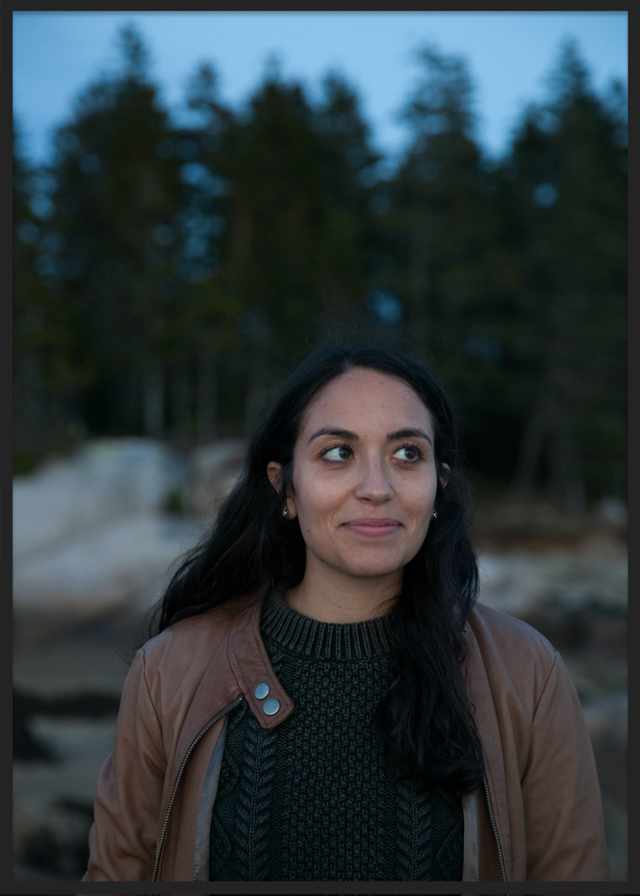
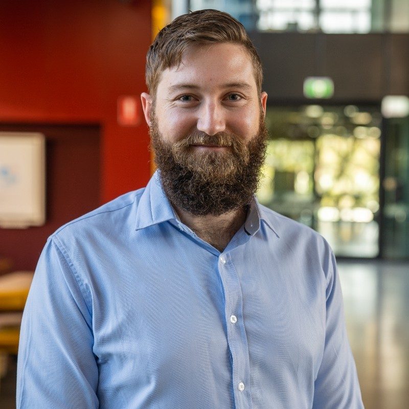
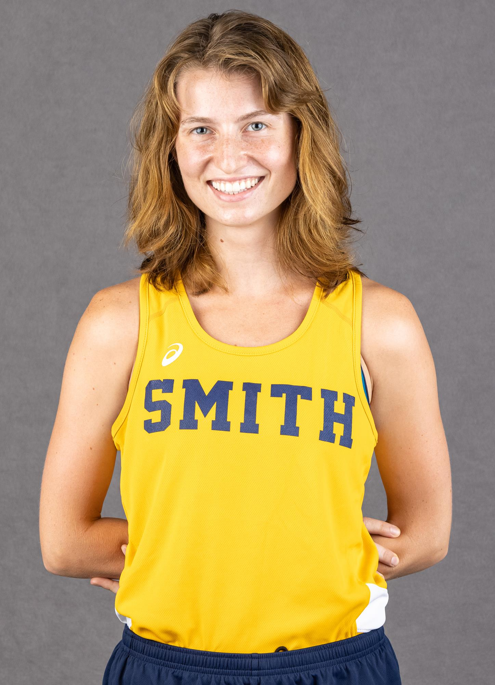

Principal Investigator
---
Dr. Tanya Lama received her doctorate from UMass Amherst and completed the National Science Foundation Postdoctoral Research Fellowship in Biology jointly hosted by the Dávalos Lab at SUNY Stony Brook and the Karlsson Lab at the Broad Institute of MIT & Harvard. Using genomic methods, Dr. Lama studies the evolutionary processes underlying population vulnerability, resilience, and response, particularly in the context of global climate change. Her applied conservation research on Canada lynx _(L. canadensis)_ demonstrates how genomics can bridge the gap between research, management, and policy. The Wildlife Genomics Lab at Smith College focuses on how life history traits -- particularly lifespan -- can shape evolutionary responses to rapid environmental change. Along with key collaborators <a href="https://lmdavalos.github.io/">Drs. Liliana Davalos (SUNY Stony Brook)</a> and <a href="http://batlab.ucd.ie/">Emma Teeling (University College Dublin)</a>, Dr. Lama uses comparative genomics to explore the evolution and mechanisms of aging in long-lived and short-lived species of bats and other mammals. In addition to her role as a research fellow, she received teaching pedagogy and leadership training from <a href="https://www.stonybrook.edu/commcms/iracda/">National Institutes of Health NY-CAPS IRACDA </a> – a targeted program for the development of underrepresented minority scholars in biomedical research. 

---
#### <u>Contact<u>

    

        

            Tanya M. Lama, PhD 
            Email: tlama@smith.edu 
        

        

        
        

    

[Curriculum Vitae ]({{ BASE_PATH }}/assets/) 

  

      <ul class="nav">
          <li><a href="https://hackmd.io/@tlama/aboutme">HackMD</a></li>
          <li><a href="https://github.com/tanyalama">GitHub</a></li>
          <li><a href="https://twitter.com/tanyalama">Twitter (@tanyalama)</a></li>
      </ul>
  

Group Members
---
Dr. Blair Bentley  
---
#### <u>Contact<u>

    

        

            Name  
            Email: bbentley@smith.edu 
        

        

        
        

    

[Curriculum Vitae ]({{ BASE_PATH }}/assets/) 

---
Margo Weber 
---
#### <u>Contact<u>

    

        

            Name  
            Email: mkweber@smith.edu 
        

        

        
        

    

[Curriculum Vitae ]({{ BASE_PATH }}/assets/) 

---
Lucy Gould
---
#### <u>Contact<u>

    

        

            Name  
            Email: lgould@smith.edu 
        

        

        
        

    

[Curriculum Vitae ]({{ BASE_PATH }}/assets/) 

---
Andrea Batista 
---
#### <u>Contact<u>

    

        

            Name  
            Email: abatista@smith.edu 
        

        

        
        

    

[Curriculum Vitae ]({{ BASE_PATH }}/assets/) 

  

      <ul class="nav">
          <li><a href="https://hackmd.io/@tlama/aboutme">HackMD</a></li>
          <li><a href="https://github.com/tanyalama">GitHub</a></li>
          <li><a href="https://twitter.com/tanyalama">Twitter (@tanyalama)</a></li>
      </ul>
  

<!-- Note: this is how to write a comment in HTML. Everything in here won't show up on your webpage.-->

<!--
To increase the size of the title, use fewer # in front of the paper title.
To decrease the size of the title, use more #. 
To remove the italics, remove the * before and after the description
To remove the underline from the title, remove the <u> tags (<u> and </u>)
-->
